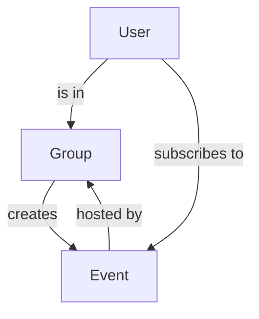

# Event page for Freestyle Frisbee



## Trello
https://trello.com/b/iEyCEVau/event-calendar

## what is it
- A page for seeing what events are happening, when and where
- Users are part of a "Group" (aka frisbee crew)
- Users can create events, and subscribe to events to receive updates
- The organizers (members of the crew) can see who has subscribed to their event and send notifications to them (useful during events)
- **no social features** Users can't see other users, no public profiles
- "new events" section, events since the last time the user looked at the page

## Installation

### Requirements
You need composer and npm installed
```
composer install
php artisan migrate
php artisan db:seed

npm install
npm run dev
```


## API
https://documenter.getpostman.com/view/32067704/2s9YyvC1LU

Simple API for getting events and groups

## Entities

### User
- Users must register to be part of a group and create events
- Can be part of many groups (aka frisbee crews)
- If they are part of a group, they can:
    - create an event
    - edit an event of that group
    - write updates (news feed)
- Can decide how they want to be contacted on changes to subscribed events
- can subscribe to a calendar with their events they are interested in

### Event
- Is hosted by a group (or frisbee crew)
- has
    - description
    - picture
    - simple timetable?
    - news feed
- Can be at a "tbd" date, in a certain month

### Group
- Events are tied to a group
- Everyone in a group can edit an event, or perform actions on it

## Pages
- /dashboard (name tbd)
- /events
- /profile
    - How to contact
    - Which crew are you part of
- /groups
    - small profile page for the crew
- /login
- /register

## For the future
- Page also has an API to get events?
- Event "Happening this month preview"
- "find jams in your area"?
- .ics subscription?

# Last updates:

- 2024-03-17
  - add link attribute to event and group
  - add group attribute to event
  - add results to api calls and web requests
